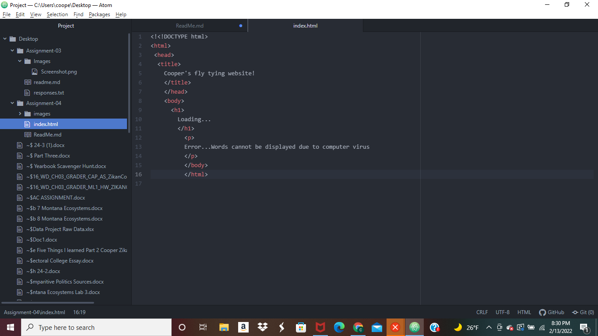

Browsers retrieve information from parts of the web and uses a rendering engine to turn large swaths of data into text and images that we can understand. Browsers allow us to search millions of websites based on our web searches. Its primary function is to render html, which is used to design websites. I mostly only use google chrome and safari. Google chrome is my favorite due to reliability.

