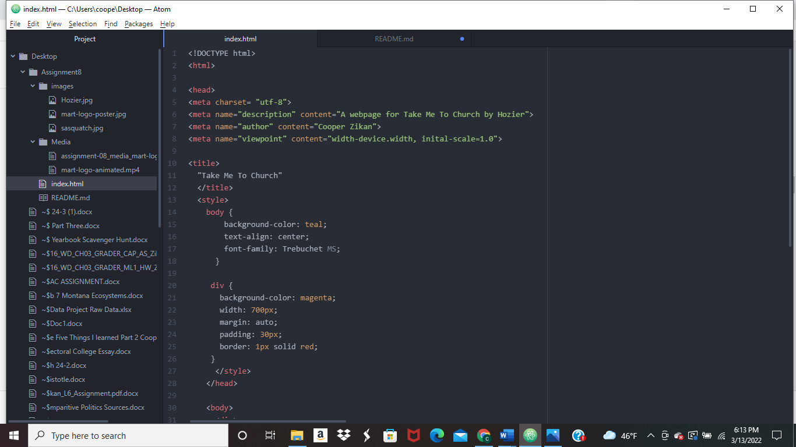

An affordance is a set of possible actions for an object. They can be tactile, auditory or a combination.
The disadvantages of third party websites for hosting videos include the loss of control and significant search engine opitimization drawbacks. The advantages include convenience, exposure and sustainability. Links are another large benefit of posting videos on third party websites.

